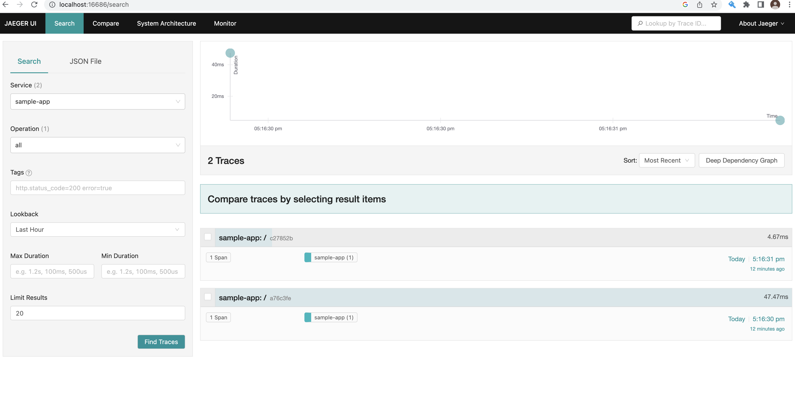

Trying java auto-instrumention with otel-collector on k8s set-up

https://opentelemetry.io/docs/instrumentation/java/automatic/

Build the containers:
- docker build -t agent-container:0.1.0 .
- docker build -t sample-java-app:0.1.0 .

- kubectl apply -f objects/jaeger.yml
- kubectl apply -f objects/otel-collector.yml
- kubectl apply -f objects/app-agent.yml

- Sample java app - localhost:4567
- Traces - localhost:16686

